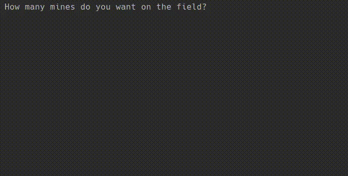

To start playing simply specify how many mines you would ike in the field, once the field is created
you will be shown the grid. Each cell on the grid will either contain a '.' or a digit (0 - 8).

The digit tells you how many mines are surrounding the cell containing the digit. If you think
one of the '.' could be a mine then mark it by passing the cells 'x' and 'y' coordinates.
Once marked the cell will no longer appear as a '.' but as a '*'. To unmark the cell just pass
the same coordinates when asked to do so.

The game ends once all the mines have been discovered.

IMPORT FROM FILE ----------

If you would like to import a custom grid please use the following format:

9 9
.........
...X.....
X........
.........
X..X.....
.........
.....X...
X........
X........

The first line should include the size of the grid separated by a space.
This is followed by marking the cells which are mines as 'X' and leaving
the ones that aren't as '.'

